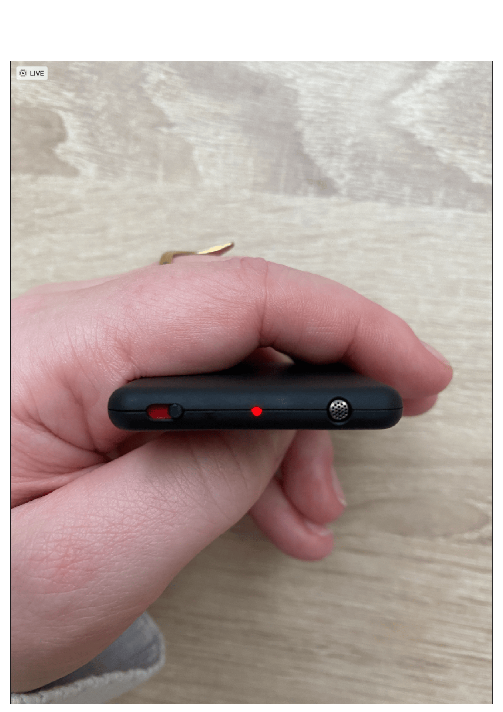
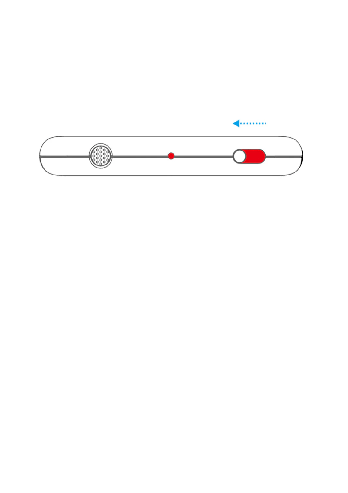
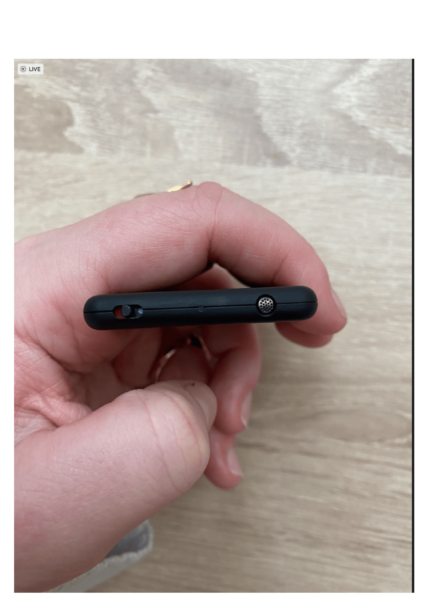
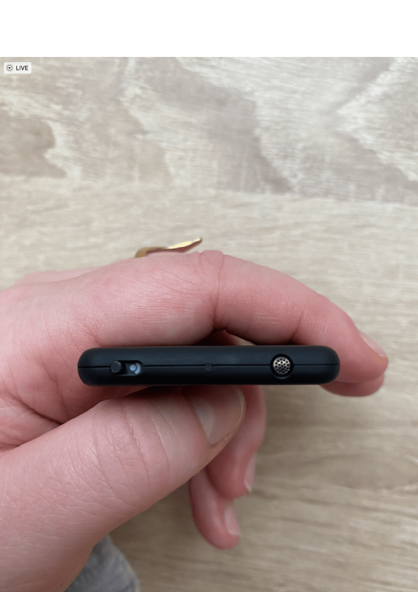

# Guide d'utilisation — Enregistreur iZYREC 🎤

Ce guide vous accompagne pas à pas dans l'utilisation de l'enregistreur audio iZYREC dans le cadre du projet HéLiCéO. Lisez-le attentivement avant votre première journée d'enregistrement.

---

## 📦 Matériel reçu

Vous devriez avoir reçu :

1. Un harnais
2. Un enregistreur iZYREC par enfant
3. Une enveloppe pour retourner le matériel

> Les harnais peuvent présenter quelques taches, mais rassurez-vous — ils ont été lavés plusieurs fois et sont propres. Votre enfant ne court aucun risque.

---

## 📋 Avant de commencer

**La veille au soir**, préparez le harnais avec l'enregistreur pour vous rappeler de démarrer l'enregistrement dès le réveil de votre enfant le lendemain matin.

- Surveillez le positionnement du dispositif pour assurer son bon fonctionnement et sa sécurité pendant l'utilisation.

---

## 📅 Quand enregistrer ?

**Le jour idéal :**

- Un week-end typique où l'enfant et ses frères et sœurs sont à la maison
- Un jour sans événements spéciaux (pas de fêtes, célébrations, etc.)
- En présence uniquement de la famille ou d'amis proches

> Les enregistrements peuvent s'étendre sur plusieurs jours — par exemple, l'enfant enregistré le vendredi, et les frères et sœurs le samedi.

**À éviter :**

- Les jours de crèche, école maternelle ou école — difficile d'obtenir le consentement de toutes les personnes présentes
- Les jours où d'autres personnes seront présentes pendant de longues périodes

**Durée idéale :** du réveil jusqu'au coucher.

---

## 💡 Conseils importants

- **Comportez-vous normalement** — nous avons besoin d'enregistrements naturels. Nous n'écouterons pas le contenu de vos conversations.
- **Vous pouvez éteindre l'enregistreur** pendant les siestes et les bains.
- **Pour les repas** — ajoutez un bavoir pour protéger l'enregistreur de l'humidité.
- **Vous gardez le contrôle** — si vous souhaitez arrêter l'enregistrement ou demander la suppression de portions, vous êtes entièrement dans votre droit.
- **Informez les autres si nécessaire** — si des personnes extérieures à votre foyer parlent près de votre enfant, informez-les que votre enfant porte un enregistreur et fournissez-leur les coordonnées du chercheur si elles ont des questions.

---

## ▶️ Utilisation de l'enregistreur iZYREC

### Comment démarrer, arrêter et contrôler l'enregistrement ?

| Étape | Instruction | Image |
|-------|-------------|-------|
| **1. Démarrer l'enregistrement** | Allumez l'enregistreur en basculant le bouton pour faire apparaître la partie rouge en entier. Une lumière rouge constante s'allumera au milieu, indiquant que l'enregistrement est en cours. |   |
| **2. Arrêter l'enregistrement** | Pour l'éteindre, basculez le même bouton en position médiane. |  |
| **3. Mode contrôle application** | Pour passer en mode de contrôle par l'application iZYREC, basculez le bouton de l'autre côté — une lumière rouge apparaîtra. |  |

---

*Document élaboré par l'équipe ExELang & HéLiCéO — LSCP, École Normale Supérieure*
