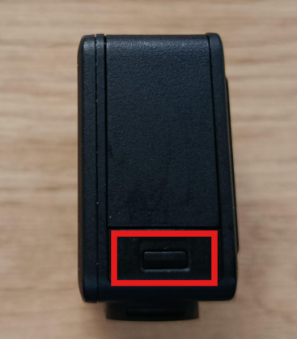
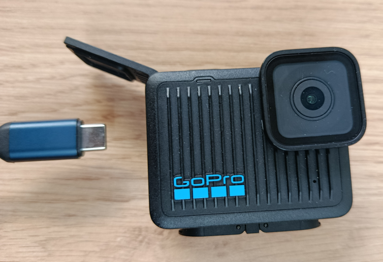
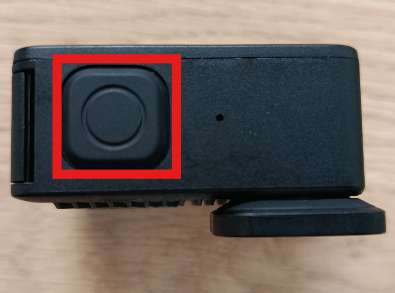
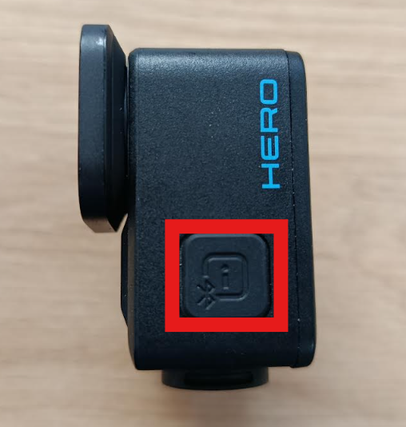
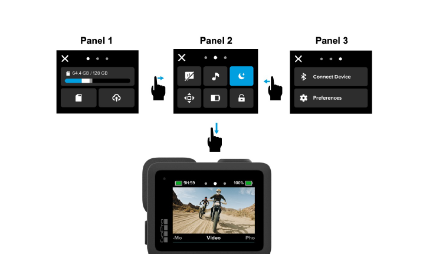
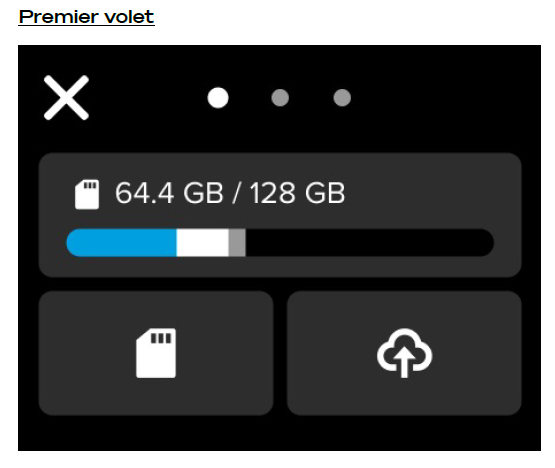
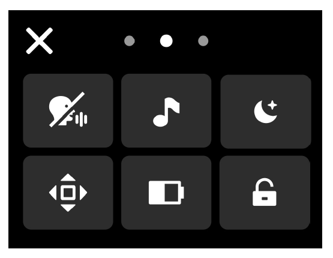
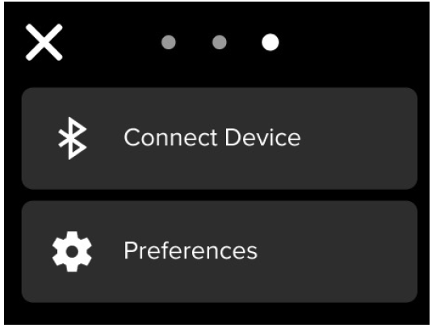

# Caméra GoPro Hero -Guide d'utilisation 🎥

Merci d'accepter de participer à notre récolte de données. Ce guide vous accompagne dans la prise en main de la caméra GoPro Hero.

Les réglages de base seront effectués de notre côté avant de vous remettre l'appareil. Il est néanmoins recommandé de vérifier certains paramètres avant chaque utilisation.

---

## 🔋 Première prise en main

**1. Recharger la caméra**

Branchez la batterie sur le chargeur, puis connectez la caméra via le câble USB-C.

---

**2. Allumer la caméra**

Appuyez sur le bouton latéral pour allumer l'appareil.

---

**3. Vérifier que la batterie est chargée**

L'indicateur de batterie s'affiche en haut de l'écran. Vérifiez qu'elle est suffisamment chargée avant de commencer.

---

## ⚙️ Paramètres à vérifier avant chaque utilisation

La GoPro Hero (2024) dispose d'un tableau de bord en **trois volets** accessibles en glissant vers le bas depuis l'écran allumé, puis vers la droite ou vers la gauche.
Nous recommandons de vérifier en particulier les paramètres de date et d'heure avant chaque enregistrement, par précaution. C'est une étape importante pour le transfert des données en fin de journée d'enregistrement 

> 💡 Les fonctionnalités sont **activées** lorsque leurs icônes deviennent **bleues**.

---

### Volet 1 — Carte SD

> ⚠️ **Toujours désactiver le transfert automatique** — Le transfert vers le cloud nécessite un abonnement GoPro que nous n'utilisons pas, pour la protection des données des participants.

**Transfert des données :** il sera toujours **manuel**, à l'aide du câble USB-C spécifique fourni avec la GoPro. Ce câble permet de transférer les vidéos de la caméra vers votre ordinateur.

> Si le câble est perdu, utilisez un lecteur de carte micro SD pour effectuer le transfert. (cf. guide [Gestion de données](https://laac-lscp.github.io/lfr-heliceo-training/05_gestion_donnees/))

 [HomeBank](https://homebank.talkbank.org/)

---

### Volet 2 — Contrôle rapide

*L'ordre des paramètres suit l'ordre des icônes sur le volet, de gauche à droite.*

| Paramètre | Action recommandée |
|-----------|-------------------|
| **Contrôle vocal** | ❌ Désactiver — économise la batterie et évite les coupures durant les enregistrements |
| **Bips** | ✅ Activer — signal sonore à chaque début d'enregistrement |
| **Économiseur d'écran** | ✅ Activer — régler sur 2 min dans Préférences > Affichage |
| **Orientation** | ✅ Verrouiller l'orientation de l'écran |
| **Économiseur de batterie** | ✅ Activer |
| **Verrouillage de l'écran** | ✅ Verrouiller — évite les manipulations accidentelles (utile au contact de l'eau) |

---

### Volet 3 — Appariement et préférences

| Paramètre | Action recommandée |
|-----------|-------------------|
| **Appairer un appareil** | ❌ Ne jamais appareiller — pour la sécurité des données personnelles des participants |
| **Préférences** | ✅ Vérifier la **date et l'heure** avant chaque session — un décalage complique le nommage des fichiers et la synchronisation avec les carnets de terrain |

---

## ⚠️ Points clés à retenir

- Ne jamais activer le transfert automatique vers le cloud
- Ne jamais appairer la caméra avec un appareil extérieur
- Toujours vérifier la date et l'heure avant chaque enregistrement
- Toujours transférer les données manuellement en fin de journée

---

*Document élaboré par l'équipe ExELang & HéLiCéO — LSCP, École Normale Supérieure*
