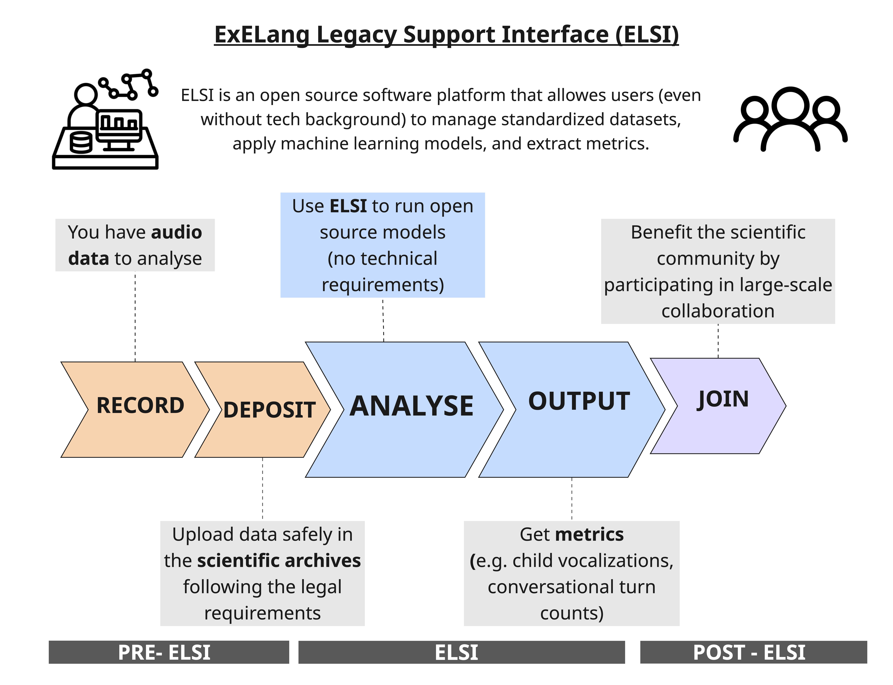
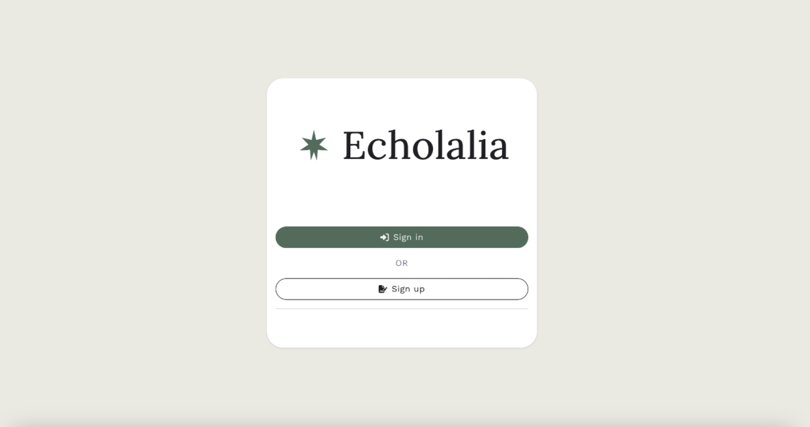
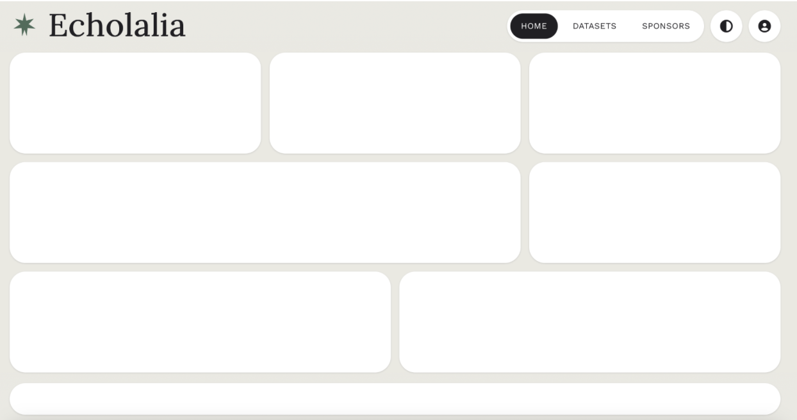
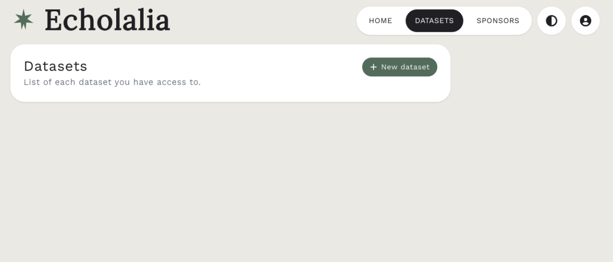
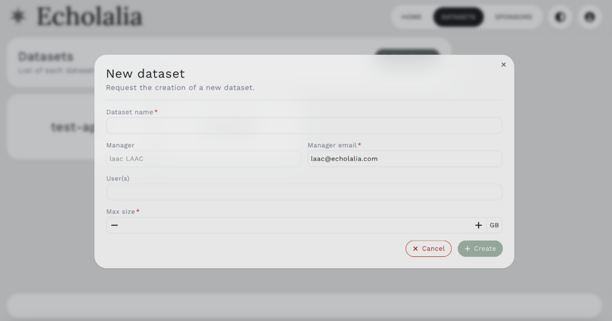
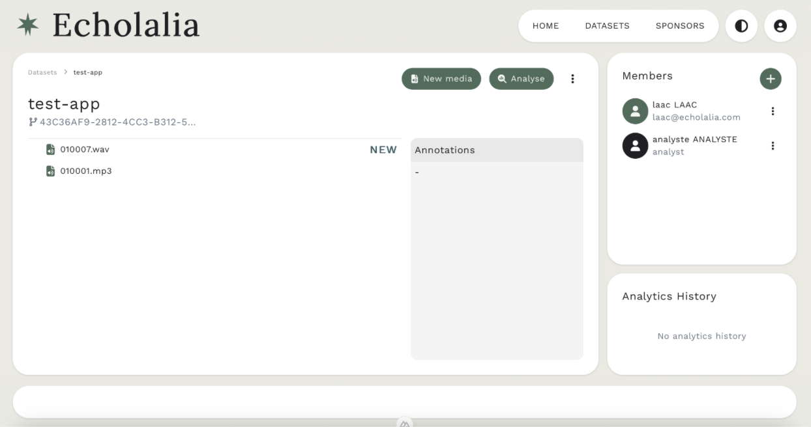
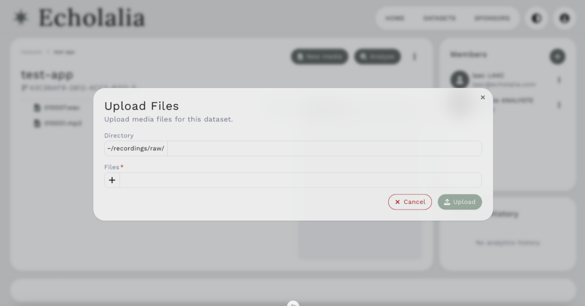
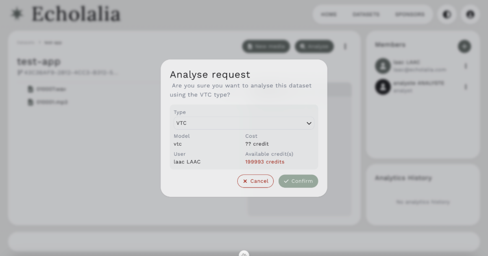
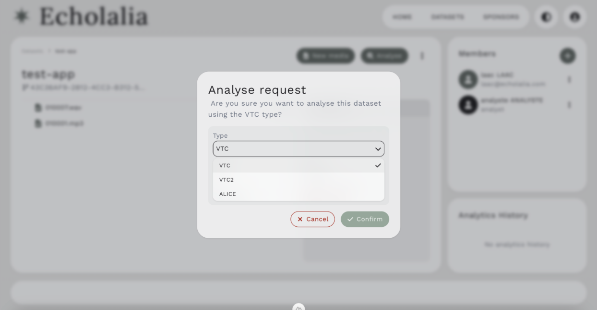
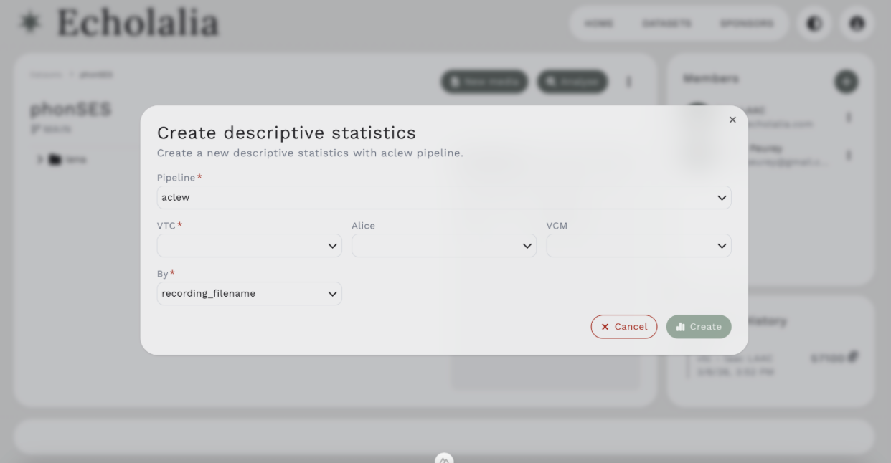

# Documentation ELSI — ExELang Legacy Support Interface

Bienvenue dans la documentation d'ELSI (ExELang Legacy Support Interface). L'objectif de cette documentation est de présenter les fonctionnalités de l'outil et d'expliquer comment l'utiliser.

## Vue d'ensemble et objectifs

Les enregistrements de longue durée (Long-Form Recordings — LFR) d'enfants en contexte naturel constituent un type de données de recherche riche, mais complexe à exploiter. D'un corpus à l'autre, l'organisation, la documentation et le stockage varient considérablement, ce qui rend les analyses inter-corpus fastidieuses et sources d'erreurs. Les enregistrements bruts sont éthiquement sensibles, or la plupart des outils existants ne proposent aucun mécanisme intégré permettant de gérer des niveaux d'accès différenciés selon les protocoles de consentement et d'éthique. Enfin, l'extraction de métriques significatives — via des classificateurs de type de voix, de maturité vocale ou d'autres modèles d'apprentissage automatique — requiert une expertise technique que de nombreux chercheurs ne possèdent pas.

ELSI (ExELang Legacy Support Interface) est une plateforme logicielle permettant à tout utilisateur, quel que soit son niveau technique, de gérer des jeux de données standardisés, d'appliquer des modèles d'apprentissage automatique et d'extraire des métriques à partir d'enregistrements de longue durée centrés sur l'enfant. ELSI s'appuie sur le framework ChildProject et l'infrastructure DataLad, dont il hérite les pipelines de métadonnées standardisés et les capacités de versionnage.

Plus précisément, le package Python ChildProject pour la gestion des données LFR résout les différences de structure et d'organisation en imposant une structure de répertoires cohérente et un schéma de métadonnées commun à tous les corpus. Chaque corpus suit un schéma partagé avec des métadonnées à trois niveaux : enfant (ex. identifiant, date de naissance), enregistrement (ex. identifiant d'enregistrement, identifiant enfant, date) et annotation. Les métadonnées au niveau de l'annotation, générées automatiquement par ChildProject, associent chaque fichier d'annotation au segment audio correspondant — les annotations humaines des LFR ne couvrant généralement que des sections échantillonnées plutôt que l'enregistrement complet. DataLad ajoute un contrôle de version basé sur git pour les annotations, et git-annex pour la gestion des fichiers volumineux, permettant des structures de jeux de données imbriquées qui favorisent la reproductibilité.

<figure markdown>
  <figcaption>Figure 1 : L'écosystème ELSI</figcaption>
</figure>

---
---

# Prérequis et configuration

### Dépôt des données sur des archives scientifiques

ELSI ne gère pas les autorisations légales ou éthiques liées à la réutilisation des données. Vous devez donc déposer votre jeu de données dans l'une des archives scientifiques suivantes :

1. [HomeBank](https://homebank.talkbank.org/)
2. [Databrary](https://databrary.org/)
3. [The Language Archive](https://archive.mpi.nl/)

Ces trois archives prennent en charge les enregistrements de longue durée et vous permettent de contrôler qui peut légalement accéder à vos données. Les jeux de données non déposés dans une archive seront supprimés d'ELSI. Lors du dépôt, vous devez ajouter notre laboratoire en tant que collaborateur.

### Compte et accès

Nous recommandons d'utiliser le navigateur **Chrome** pour accéder à ELSI.

Si c'est votre première utilisation, vous devrez créer un compte. Sinon, connectez-vous avec vos identifiants : https://elsi-lscp.ddns.net/identify/login

Un administrateur devra approuver votre compte lors de la première connexion, ce qui peut prendre **24 à 48 heures**. En cas de délai, contactez Kaveri à l'adresse suivante : ksheth2019@gmail.com

Une fois votre compte approuvé, rendez-vous ici : https://elsi-lscp.ddns.net/maildev/#/email/abTJlKrh et utilisez le mot de passe provisoire pour vous connecter et le modifier.

Pour accéder au site, cliquez sur ce lien : https://elsi-lscp.ddns.net/identify/login

Voici à quoi ressemble la page d'accueil (Figure 2) :

<figure markdown>
  <figcaption>Figure 2 : Page d'accueil d'ELSI</figcaption>
</figure>

 
  Une fois connecté, l'écran devrait ressembler à la Figure 3 :

<figure markdown>
  <figcaption>Figure 3 : Premier écran après connexion à ELSI</figcaption>
</figure>

---
---
# Ajouter un jeu de données

Dans le coin supérieur droit, vous verrez ACCUEIL, JEUX DE DONNÉES, SPONSORS. Pour commencer à ajouter un jeu de données, cliquez sur le bouton **JEUX DE DONNÉES**. Votre écran devrait maintenant ressembler à ceci (Figure 4) :

<figure markdown>
  <figcaption>Figure 4 : Page d'accueil du jeu de données</figcaption>
</figure>

 

### Créer un nouveau jeu de données

Pour demander la création d’un nouveau jeu de données (qui devra être approuvé par un administrateur dans un délai de 24 à 48 heures), cliquez sur le bouton vert **+ Nouveau jeu de données**. L’écran devrait alors ressembler à la Figure 5.

<figure markdown>
  <figcaption>Figure 5 : Pour ajouter un nouveau jeu de données</figcaption>
</figure>

Remplissez les informations (c’est-à-dire : **Nom du jeu de données**, **Utilisateur(s)** et **Taille maximale**). Une fois cela fait, l’administrateur l’approuvera (ou vous contactera en cas de problème dans un délai de 24 à 48 heures). Une fois créé, cela devrait ressembler à la Figure 6.

<figure markdown>
  <figcaption>Figure 6 : Création d'un nouveau jeu de données vide</figcaption>
</figure>

### Ajouter de nouveaux médias au jeu de données

Une fois votre jeu de données approuvé, vous pouvez télécharger (individuellement ou par lots) des fichiers audio volumineux (**mp3, wav**) avec une taille maximale de **2 Go par fichier**. Pour ce faire, cliquez sur le bouton **Nouveau média** pour ajouter des fichiers audio (Figure 7).

<figure markdown>
  <figcaption>Figure 7 : Ajout de nouveaux médias</figcaption>
</figure>

---
---

# Exécuter des analyses

Une fois tous vos fichiers téléchargés, vous pouvez exécuter des analyses. Cliquez sur le bouton **Analyser** à côté du bouton **Nouveau média**. Votre écran ressemblera alors à la Figure 8.

<figure markdown>
  <figcaption>Figure 8 : Analyser votre audio</figcaption>
</figure>

Vous pouvez choisir quel modèle utiliser pour analyser les données (par exemple : VTC, VTC2, ALICE) (Figure 9).

<figure markdown>
  <figcaption>Figure 9 : Choix du modèle à exécuter</figcaption>
</figure>
 
 
Une fois l'analyse exécutée, les annotations s'afficheront dans la case étiquetée **« annotations »** avec le modèle que vous avez choisi, et vous pourrez télécharger les fichiers CSV (Figure 10).

<figure markdown>
  <figcaption>Figure 10 : Affichage des annotations après exécution du modèle</figcaption>
</figure>

### Générer des statistiques

Vous pouvez également générer des statistiques descriptives (Figure 11) en cliquant sur les **3 boutons** à côté du bouton vert **Analyser**. Vous pouvez les générer avec le pipeline **aclew** ou **LENA**. Ensuite, choisissez quel ensemble d'annotations vous utilisez pour **VTC**, **ALICE** ou **VCM**, puis vous pouvez générer les statistiques par **nom de fichier**, **ID enfant** ou **ID de session**. Une fois cela fait, un fichier CSV sera généré et téléchargé automatiquement sur votre ordinateur.

<figure markdown>
  <figcaption>Figure 11 : Exécution des statistiques descriptives</figcaption>
</figure>
